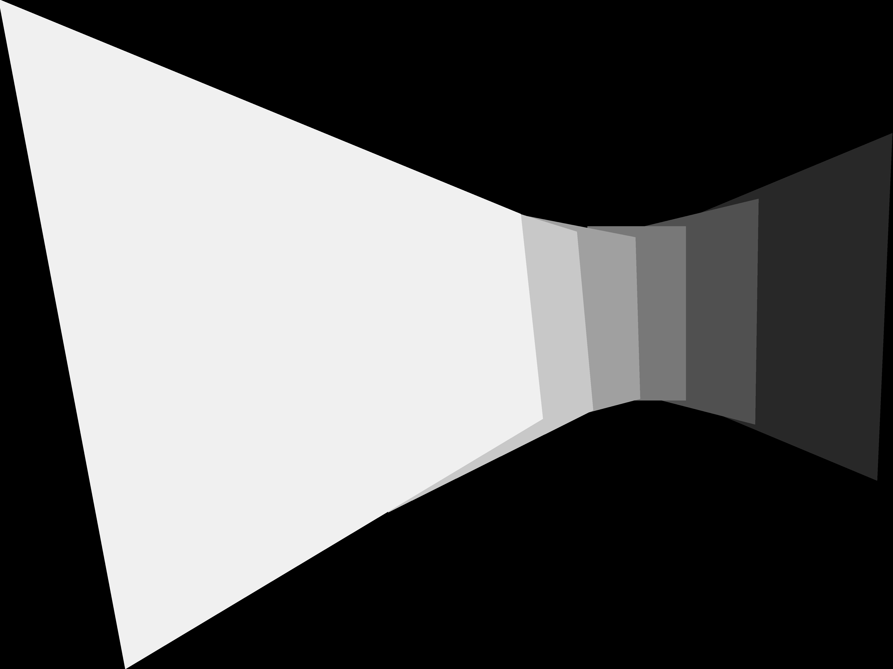
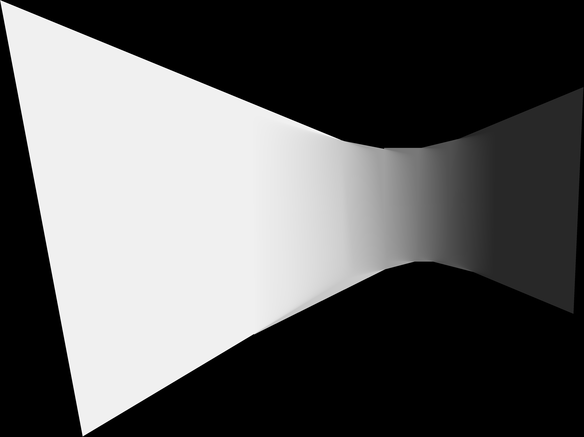

# panorama-stitching 全景图像拼接

Course Project of Virtual Reality

成员：熊天翼，潘紫琪，弋紫轩

~~~
需涵盖的内容包括：实现方案、难点及解决方案、不足之处和可能的改进方案、【组员分工情况】等。
~~~

### 使用方式

~~~
python main.py <input-dir> --blending [no/simple/mbb]
~~~
输出位于`input-dir/result`

### 代码框架

~~~
工作路径
|-- inputs ##输入图片和结果
|-- src # 源代码
|-- main.py # 主程序
~~~

#### Stitcher
封装了全景拼接所需的全部功能，包括载入input图片，SIFT，相关图片的matching，并计算每个输入图片的H矩阵，匹配全景图，并最后生成结果

#### Matcher
用于通过特征点找到匹配的图片对，并得到connected-components（每个component对应一张全景图，以及全景图中各图片的相关关系）

#### PairMatch
用于表示一对匹配上的图片（A and B），可用于判断匹配是否有效（valid）、计算Homograhy矩阵

### 难点与解决方案

**1、如何实现多组图片的分别拼接？**

在输入图片分属于不同全景图时，我们在matching的过程中会查询图片之间的关联性，把每一组互相关联的图片分成不同的组（connected-component），在组内计算homography矩阵并生成最后的结果。

**2、视角选择**

在计算homography矩阵时，实际上计算的都是其余照片相对于某张基准图片（H矩阵为单位阵）的位置。在选取基准图片时，我们遍历了所有可能的图片，选取拼接图片高度最小的结果输出（这样拼接图片基本在视角正中心）。

**2、如何提升照片的拼接效果**

### 局限性与可改进方向

### 实验结果

#### 基础版本（无 Gain Compensation）

|选项|blending mask|输出全景图|
|--|--|--|
|no-blending|||
|simple-blending|||

其中blending mask 图中颜色的深浅用于区分不同图片，意在用mask的离散程度展示融合效果

### 小组分工
- 熊天翼：完成全景图像拼接的python代码基础框架（SIFT + 特征点匹配 + matching + 拼接），实现了多图拼接和simple blending功能。
